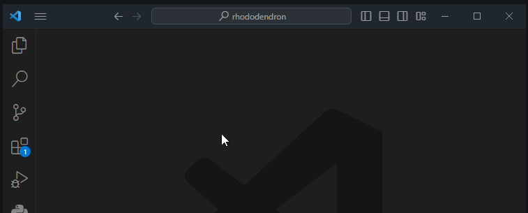

# Добавляем изменения

В проекте используется модель ветвления [GitHub Flow][github-flow].

Актуальная версия сайта находится в ветке `main`.
Все изменения добавляются через слияние временных веток.

Временные ветки именуются по смыслу, на латинице, маленькими буквами
и разделителем `-` между словами.

Например, если я хочу добавить статью про слоновью ногу,
то ветку можно назвать `elephant-foot`.

## Создаем временную ветку

1. Открываем панель _Source Control_ (++ctrl+shift+g++)
    и раскрываем область _BRANCHES_
2. Жмем _Create Branch..._
3. Вводим название ветки и нажимаем ++enter++
4. Жмем пункт _Create & Switch to Branch_

<figure markdown="span">
    
</figure>

## Вносим изменения

Все страницы сайта создаются из `.md` файлов в каталоге `docs`.
С базовым синтаксисом можно ознакомиться на [Markdown Guide][markdown-guide].
Требования к синтаксису для данного проекта
смотри на [How to chaberch][how-to-chaberch].

Для предварительного просмотра можно нажать _Open Preview to the Side_.

<figure markdown="span">
    
</figure>

Новые файлы следует создавать с учетом иерархии сайта.
Например, статью про слоновью ногу надо поместить в `docs/проблемы-печати/`.

## Добавляем статью в оглавление

Если не добавить статью в оглавление то она не появится на сайте.

1. Открываем в корне проекта файл `mkdocs.yml`
2. Ищем блок `nav`
3. Дописываем в него название страницы (которое должно отображаться)
    и путь к `.md` файлу, разделяя их двоеточием

Например, так:

``` yaml title="mkdocs.yml"
nav:
  - Проблемы печати:
    - Карта: 'проблемы-печати/карта.md'
    - Слоновья нога: 'проблемы-печати/слоновья-нога.md'
  - Contributing:
    - Инструментарий: 'contributing/инструментарий.md'
    - Проект: 'contributing/проект.md'
    - Добавляем изменения: 'contributing/добавляем-изменения.md'
```

## Проверяем как все отображается на сайте

1. Открываем панель _Python_
2. Жмем _Open in Terminal_
3. В открывшемся терминале вводим команду `mkdocs serve`
4. Открываем в браузере страницу <http://127.0.0.1:8000/>

<figure markdown="span">
    
</figure>

## Отправляем на проверку

1. Открываем панель _Source Control_ (++ctrl+shift+g++)
2. Переходим в область _SOURCE CONTROL_
3. Вводим краткое описание для обновлений
    (с большой буквы, без точки в конце, в прошедшем времени, можно на русском)

    Например, для статьи про слоновью ногу можно написать
    `Добавил статью про слоновью ногу`.

4. Из выпадающего списка у кнопки _Commit_
    выбираем _Commit & Create Pull Request_

    Если выскачет сообщение _There are no staged changes to commit..._,
    то нажимаем _Always_

5. В открывшейся панели нажимаем _Create_

[github-flow]: https://docs.github.com/en/get-started/using-github/github-flow
[markdown-guide]: https://www.markdownguide.org/basic-syntax/
[how-to-chaberch]: https://chaberch.github.io/how-to-chaberch/markdown/
