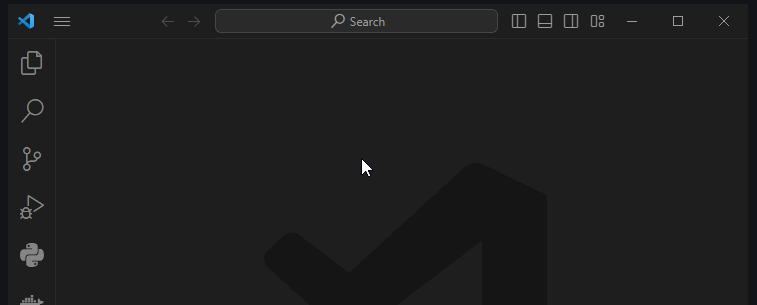
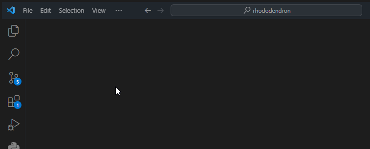

# Проект

## Клонируем последнюю версию проекта

``` urlencoded
https://github.com/chabErch/rhododendron.git
```

1. В _VS Code_ открываем панель _Source Control_ (++ctrl+shift+g++)
    и нажимаем _Clone Repository_.
2. Вставляем url проекта в открывшуюся панель и нажимаем на _Clone from URL_.
3. Указываем путь куда клонировать проект

<figure markdown="span">
    
</figure>

## Устанавливаем плагины

1. В _VS Code_ открываем панель _Extensions_ (++ctrl+shift+x++)
2. Вставляем в поле поиска `@recommended`
3. Жмем _Install Workspace Recommended Extensions_

<figure markdown="span">
    
</figure>
