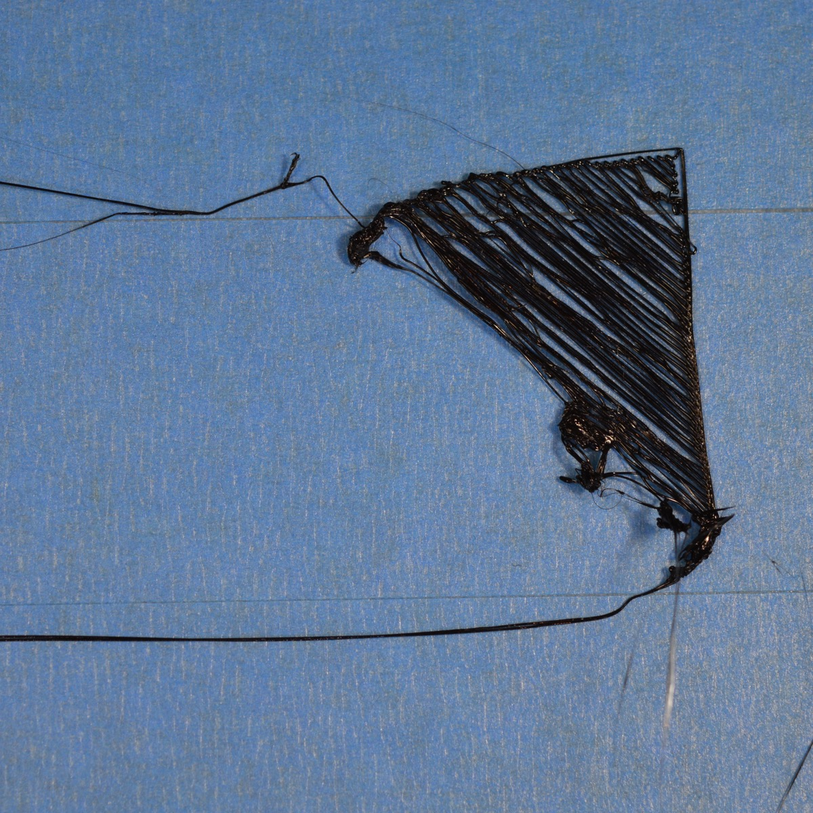

# Первый слой не прилипает к столу

## Почему

Не хватает адгезии или неправильный температурный режим

## Как исправить

<!-- TODO: Изменить стиль обращения к пользователю -->

1. Выровнять стол для печати

    Во многих слайсерах есть функция выравнивания стола,
    которая поможет преодолеть эту проблему,
    если принтер оснащен автоматической настройкой.
    Иначе выровнять вручную

2. Настроить ноль по оси Z

    Расстояние между столом и соплом должно быть в районе 0.2 мм

3. Дать время первому слою на застывание

    Это достигается либо уменьшением скорости печати первого слоя,
    либо сделать паузу после того как первый слой напечатается

4. Настроить температуру печати или охлаждения

    Для избегания усадки пластика
    поддерживать температуру стола на одном уровне,
    при первых слоях отключить вентилятор, в зависимости от филамента

5. Увеличить адгезию печатающей поверхности

    Использовать разные виды клейкой ленты,
    липкие вещества как клей-карандаш или спрей для волос

6. Использовать обводку на первом слое

    Если модель имеет малые размеры,
    то стоит увеличить площадь примыкания первого слоя
