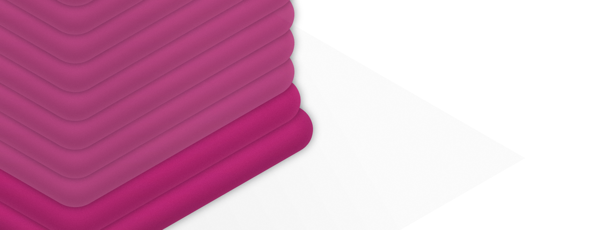

# Слоновья нога (список)

Основание выпирает наружу.

## Почему

Нижние слои не успевают затвердеть и выдавливаются под тяжестью верхних слоев.
Особенно актуально для принтеров с подогревом стола.

## Как исправить

1. Понизить температуру стола

    Пробуй понижать по 5°.
    Но не делай температуру ниже 20° от рекомендуемой,
    иначе нижние слои начнут деформироваться.

2. Откалибровать уровень стола / поднять сопло

    На первых слоях сопло не должно быть слишком низко
    (скрести выдавливаемый филамент),
    или слишком высоко (наваливать филамент)

3. Добавить фаску (костыль)

    Сними фаску с основания модели.
    Начни с 45° и 5 мм (не много ли?)
